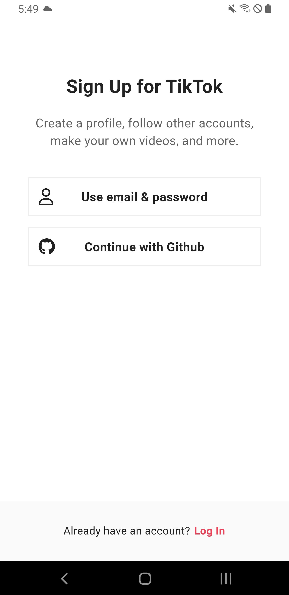
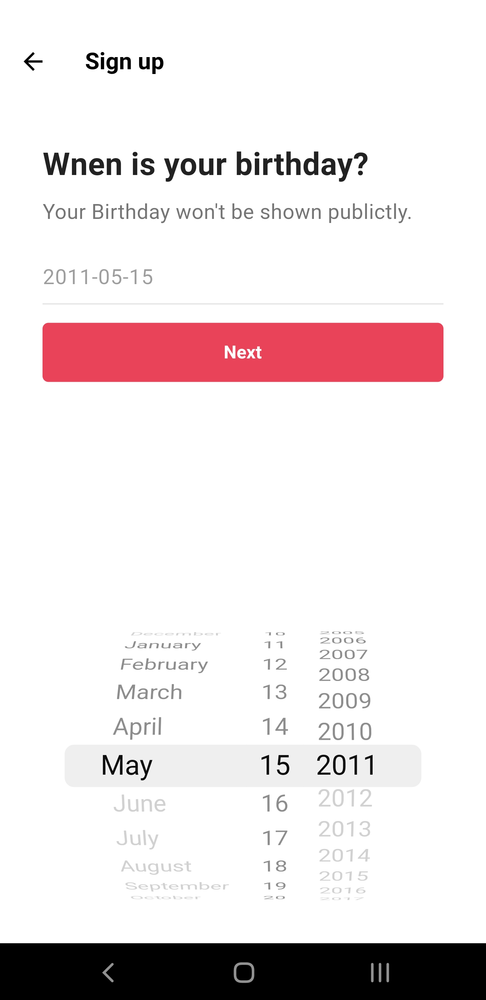
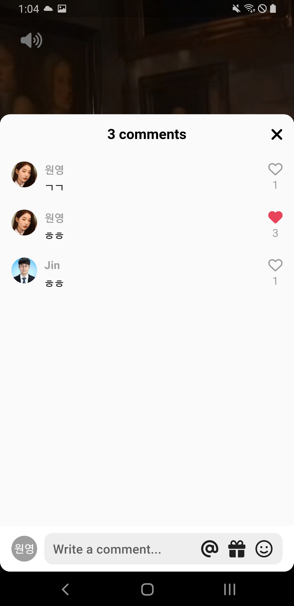
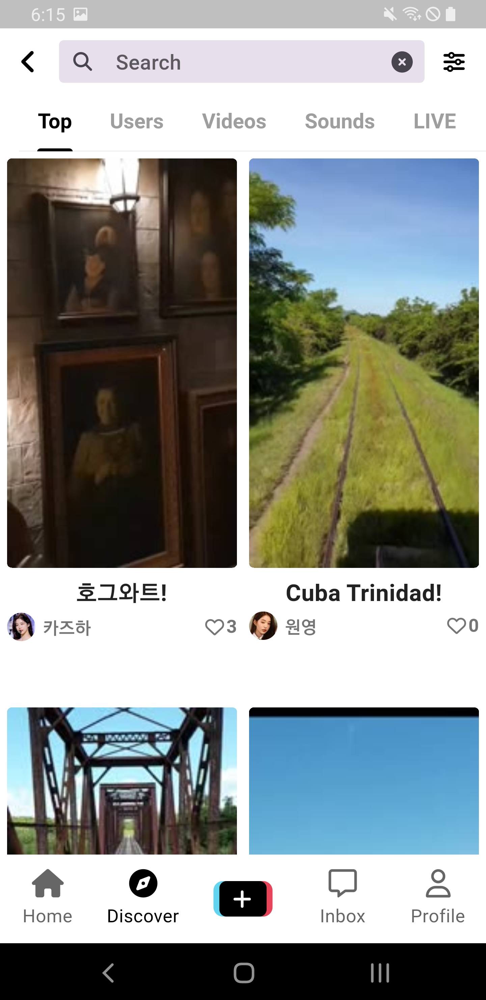
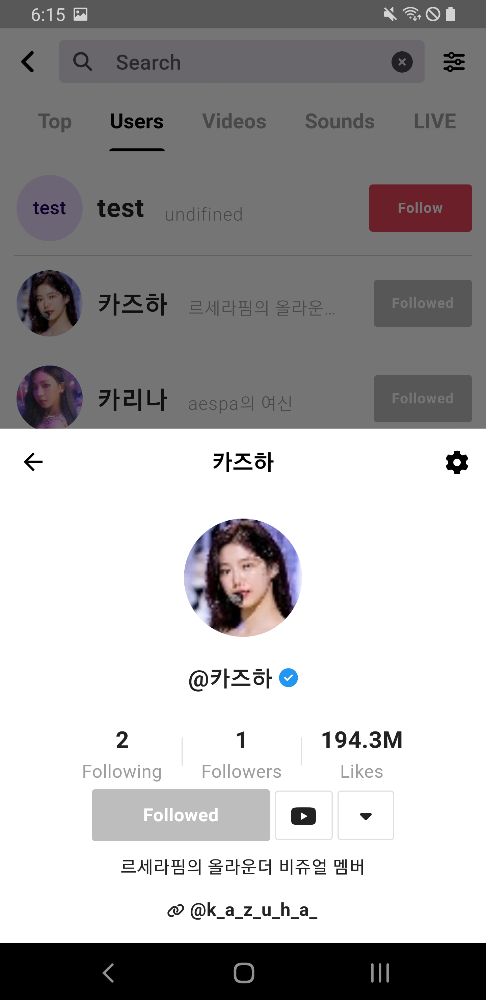
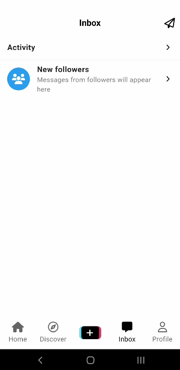
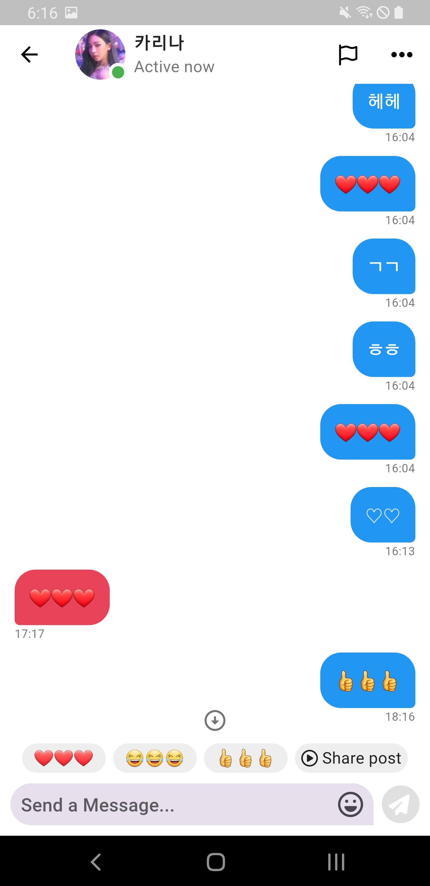

# TikTok Clone

### Portfolio

[Notion Link](https://jinsoopark.notion.site/TikTok-Clone-f4f63b6fd02145e580afd9661069bccb)


### Screen shot

[Youtube](https://youtu.be/vhiCTNhQvV8)


       

### Design Pattern

MVVM with Riverpod


### Source tree
```
lib
|
│  firebase_options.dart
│  main.dart
│  router.dart
│  utils.dart
│
├─common
│  └─widgets
│      ├─main_navigation
│      │  │  main_navigation_screen.dart
│      │  │
│      │  └─widgets
│      │          nav_tab.dart
│      │          post_video_button.dart
│      │
│      └─video_configration
│              video_config.dart
│
├─constants
│      breakpoints.dart
│      gaps.dart
│      sizes.dart
│
├─features
│  ├─authentication
│  │  ├─repos
│  │  │      authentication_repo.dart
│  │  │
│  │  ├─views
│  │  │  │  birthday_screen.dart
│  │  │  │  email_screen.dart
│  │  │  │  login_form_screen.dart
│  │  │  │  login_screen.dart
│  │  │  │  password_screen.dart
│  │  │  │  sign_up_screen.dart
│  │  │  │  username_screen.dart
│  │  │  │
│  │  │  └─widgets
│  │  │          auth_button.dart
│  │  │          form_button.dart
│  │  │
│  │  └─view_models
│  │          login_view_model.dart
│  │          signup_view_model.dart
│  │          social_auth_view_model.dart
│  │
│  ├─discover
│  │  ├─views
│  │  │      discover_screen.dart
│  │  │
│  │  └─view_models
│  │          divcover_view_model.dart
│  │
│  ├─inbox
│  │  ├─models
│  │  │      chat_room_model.dart
│  │  │      message_model.dart
│  │  │
│  │  ├─repos
│  │  │      chat_room_repo.dart
│  │  │      messages_repo.dart
│  │  │
│  │  ├─views
│  │  │      activity_screen.dart
│  │  │      chats_screen.dart
│  │  │      chat_detail_screen.dart
│  │  │      chat_user_list_screen.dart
│  │  │      inbox_screen.dart
│  │  │
│  │  └─view_models
│  │          chat_room_view_model.dart
│  │          messages_view_model.dart
│  │
│  ├─notifications
│  │      notifications_provider.dart
│  │
│  ├─onboarding
│  │  │  interests_screen.dart
│  │  │  tutorial_screen.dart
│  │  │
│  │  └─widgets
│  │          interest_button.dart
│  │
│  ├─settings
│  │      settings_screen.dart
│  │
│  ├─users
│  │  ├─models
│  │  │      user_profile_model.dart
│  │  │
│  │  ├─repos
│  │  │      user_repo.dart
│  │  │
│  │  ├─views
│  │  │  │  followers_list_screen.dart
│  │  │  │  followings_list_screen.dart
│  │  │  │  update_profile_screen.dart
│  │  │  │  user_profile_screen.dart
│  │  │  │
│  │  │  └─widgets
│  │  │          avatar.dart
│  │  │          persistent_icon_bar.dart
│  │  │          persistent_tab_bar.dart
│  │  │
│  │  └─view_models
│  │          avatar_view_model.dart
│  │          update_profile_view_model.dart
│  │          users_view_model.dart
│  │
│  └─videos
│      ├─models
│      │      playback_config_model.dart
│      │      video_comment_model.dart
│      │      video_model.dart
│      │
│      ├─repos
│      │      playback_config_repo.dart
│      │      videos_repo.dart
│      │      video_comment_repo.dart
│      │
│      ├─views
│      │  │  video_preview_screen.dart
│      │  │  video_recording_screen.dart
│      │  │  video_timeline_screen.dart
│      │  │
│      │  └─widgets
│      │          video_button.dart
│      │          video_comments.dart
│      │          video_post.dart
│      │
│      └─view_models
│              playback_config_vm.dart
│              timeline_view_model.dart
│              upload_video_view_model.dart
│              video_comment_view_model.dart
│              video_post_view_model.dart
│
├─generated
│  │  l10n.dart
│  │
│  └─intl
│          messages_all.dart
│          messages_en.dart
│          messages_ko.dart
│
└─l10n
      intl_en.arb
      intl_ko.arb
```

## Reference

NomadCoder's Lecture
